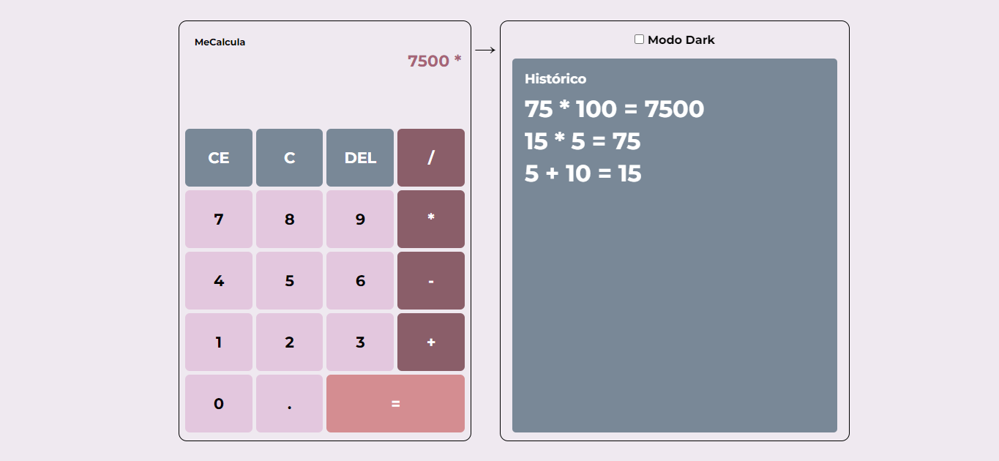
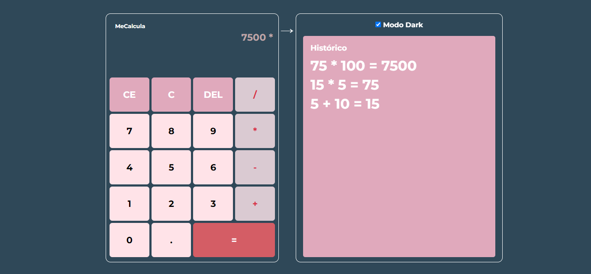

# MeCalcula

## Descrição

Uma calculadora interativa com suporte a **modo claro** e **modo escuro**, com um histórico de operações e uma interface intuitiva. A calculadora oferece operações matemáticas básicas, como soma, subtração, multiplicação, divisão, além de permitir a visualização do histórico das operações realizadas.

### Funcionalidades

* [X]  **Operações Matemáticas Básicas**: Soma, subtração, multiplicação e divisão.
* [X]  **Limpeza de Operações**: Funcionalidade para apagar o último caractere ou limpar todas as operações.
* [X]  **Modo Escuro/Claro**: Alternância entre temas claro e escuro.
* [X]  **Histórico de Cálculos**: Armazenamento e exibição do histórico das últimas operações.
* [X]  **Responsivo**: Interface adaptável para diferentes tamanhos de tela.

### Demonstração

